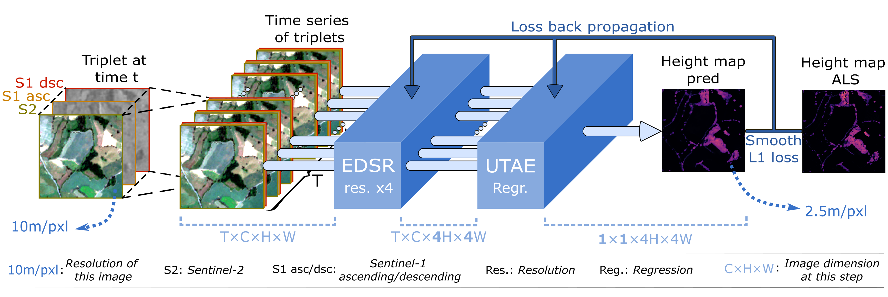

# SERA-H

[](https://www.python.org/downloads/)
[](https://pytorch.org/)
[](https://hydra.cc/)
[](https://lightning.ai/)
[](LICENSE)

> **Note**: This is the official implementation of the paper **"SERA-H: Beyond Native Sentinel Spatial Limits for High-Resolution Canopy Height Mapping"**.

## Abstract
High-resolution mapping of canopy height is essential for forest management and biodiversity monitoring. Although recent studies have led to the advent of deep learning methods using satellite imagery to predict height maps, these approaches often face a trade-off between data accessibility and spatial resolution. To overcome these limitations, we present SERA-H, an end-to-end model combining a super-resolution module (EDSR) and temporal attention encoding (UTAE). Trained under the supervision of high-density LiDAR data (ALS), our model generates 2.5 m resolution height maps from freely available Sentinel-1 and Sentinel-2 (10 m) time series data. Evaluated on an open-source benchmark dataset in France, SERA-H, with a MAE of 2.6 m and R² of 0.82, not only outperforms standard Sentinel-1/2 baselines but also achieves performance comparable to or better than methods relying on commercial very high-resolution imagery (SPOT-6/7, PlanetScope, Maxar). These results demonstrate that combining high-resolution supervision with the spatiotemporal information embedded in time series enables the reconstruction of details beyond the input sensors' native resolution. SERA-H opens the possibility of freely mapping forests with high revisit frequency, achieving accuracy comparable to that of costly commercial imagery.

## Workflow


*Figure 1: Overview of the SERA-H architecture combining Super-Resolution (EDSR) and Multi-temporal imaging (UTAE).*

## Results

Comparison of SERA-H with state-of-the-art methods:

| Model | Input images | Reference images | MAE (m) | RMSE (m) | nMAE (%) | Tree cover IoU (%) |
|-------|--------------|------------------|---------|----------|----------|--------------------|
| Pauls | S1-S2 (10m) | GEDI (10m) | 5.13 | 7.24 | 42.06% | 45.58% |
| Schwartz | S1-S2 (10m) | GEDI (10m) | 4.47 | 6.17 | 45.96% | 35.12% |
| Tolan | Maxar (1m) | ALS (1m) | 5.49 | 7.52 | 41.74% | 70.15% |
| Liu | Planet (3m) | ALS (3m) | 4.40 | 6.20 | 37.44% | 78.42% |
| Fogel | Spot 6-7 (1.5m) | ALS (1.5m) | 2.37 | 3.65 | 18.88% | 88.15% |
| **SERA-H** | **S1-S2 (10m)** | **ALS (2.5m)** | **2.60** | **3.86** | **20.40%** | **87.25%** |

*Table 1: Performance comparison on the test area at 2.5m resolution.*

> **Note**: State-of-the-art canopy height maps used for comparison were obtained either through download links provided in their respective original papers or via the Google Earth Engine API.

## Installation

### Prerequisites
- Linux or macOS
- Python 3.8+
- NVIDIA GPU + CUDA

### Setup
Clone the repository and install dependencies:

```bash
git clone https://github.com/ThomasBoudras/SERA-H.git
cd SERA-H

# Create a virtual environment (optional but recommended)
conda create -n sera-h-env -c conda-forge gdal=3.8 rasterio fiona python=3.11
conda activate sera-h-env

# Install requirements
pip install -r requirements.txt
```

## Data Preparation

### 1. Download Sentinel Data
To download the required time series data (Sentinel-1, Sentinel-2, etc.), run the following command:

```bash
python -m src.preprocessing.download.download_s1_s2_via_gdf -cn=dwd_gdf_lidarhd_timeseries
```

### 2. Clean Sentinel Data

Once you have downloaded the Sentinel-1 and Sentinel-2 data, process the raw files into a clean dataset for training with:

```bash
python -m src.preprocessing.datasets.get_clean_dataset -cn=gcd_height_map_timeseries
```

### 3. Prepare Lidar (ALS) and Forest Mask Data

To use the lidar (ALS) images and the forest mask (`forest_mask.parquet`), please manually download these files from:

[https://huggingface.co/datasets/AI4Forest/Open-Canopy/tree/main/canopy_height](https://huggingface.co/datasets/AI4Forest/Open-Canopy/tree/main/canopy_height)

Place the downloaded `forest_mask.parquet` and canopy height (lidar) files in the following directory:

```
data/open_canopy/
```

### 4. Download Pre-trained Super-Resolution Model (EDSR)

SERA-H uses EDSR as its super-resolution backbone. You need to download the pre-trained weights from the official repository:
[https://github.com/sanghyun-son/EDSR-PyTorch](https://github.com/sanghyun-son/EDSR-PyTorch?tab=readme-ov-file)

Download the model weights (e.g., `edsr_baseline_x4.pt`) and place them in:
```
data/utils/
```

After running these steps, your data should be organized as follows:

```
data/
├── utils/         # Helper data (geojsons, pre-trained EDSR weights)
├── sentinel/      # Downloaded Sentinel-1 and Sentinel-2 images
└── open_canopy/   # Lidar and forest mask data you downloaded from Hugging Face
```

## Usage

This project uses [Hydra](https://hydra.cc/) for configuration management. All configuration files are in `configs/`.

### Training
To train the model with default configuration:

```bash
python -m src.train train=h-sera_h
```

### Ablation Study
To run ablation studies, use the configuration files ending with `_as` in `configs/train/`. These configs are pre-set for specific experiments (e.g., varying number of input images).

```bash
# Example: Train with 4 input images
python -m src.train train=h-sera_h_as_04img

# Example: Train using U-Net architecture for ablation
python -m src.train train=h-unet_as
```

You can still override individual parameters from the command line:
```bash
python -m src.train train=h-sera_h_as_04img datamodule.batch_size=32
```

### Inference / Metrics

To run inference on the entire test area, use:

```bash
python -m src.predict predict=h-sera_h
```

After inference, compute the evaluation metrics based on the predictions:

```bash
python -m src.postprocessing.metrics.computes_metrics -cn=h-sera model=h-sera_h
```

## Project Structure

All outputs (logs, checkpoints, predictions, metrics) will be automatically saved in `data/logs/`.

```
SERA-H/
├── configs/                 # Hydra configuration files
│   ├── datamodule/
│   ├── module/
│   ├── train/
│   └── config.yaml          # Main config file
├── data/                    # Dataset location
│   ├── logs/                # Training logs, checkpoints, predictions and metrics
│   ├── sentinel/            # Downloaded Sentinel-1 & Sentinel-2 images
│   ├── open_canopy/         # Reference Lidar and Forest Mask
│   └── utils/               # Helper data (geojsons, etc.)
├── src/                     # Source code
│   ├── datamodule/          # LightningDataModules
│   ├── module/              # LightningModules (Model architecture)
│   ├── train.py             # Main training script
│   └── predict.py           # Inference script
├── requirements.txt         # Python dependencies
└── setup.cfg                # Project metadata
```

## Citation

If you find this code useful for your research, please cite our paper:

```bibtex
@article{boudras2025serah,
  title = {{SERA-H}: High-resolution annual canopy height mapping at 2.5 m resolution using freely available {Sentinel} data by combining super-resolution and multi-temporal imaging},
  author = {Boudras, Thomas and Schwartz, Martin and Fensholt, Rasmus and Brandt, Martin and Fayad, Ibrahim and Wigneron, Jean-Pierre and Fogel, Fajwel and Belouze, Gabriel and Ciais, Philippe},
  journal = {Submitted to Remote Sensing of Environment},
  year = {2025},
  note = {preprint}
}
```

## License
This project is licensed under the MIT License - see the [LICENSE](LICENSE) file for details.

## Contact
For any questions, feel free to contact:
Thomas Boudras - thomas.boudras@lsce.ipsl.fr

